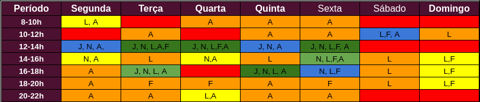
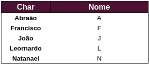
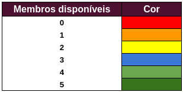

## Versionamento
|Data|Versão|Descrição|Autor(es)
|--|--|--|--|
|10/08|1.0|Adição do documento de cronogramas|Natanael Filho|
|11/08|1.1|Adição da tabela de HeatMap|João Pedro|

## 1. Heatmap

O Heatmap representa uma tabela equivalente a um mapa de calor, ou seja, mostra quantos membros da equipe estão disponíveis em determinado dia e horário. Essa tabela, é montada especialmente para auxiliar o grupo em quais horários é possível a realização de reuniões e pareamentos, bem como, para realizar as gravações [1].

<h6 align = "center">Figura 1: Heatmap da equipe. </h6>
<h6 align = "center">Fonte: Autor. </h6>

<h6 align = "center">Figura 2 e 3: Legendas heatmap. </h6>
<h6 align = "center">Fonte: Autor.</h6>

## 2. Cronograma
| Título | Entrega | Atividades e objetivos | Período | Revisor(es) |
| - | - | - | - | -|
| Início da equipe | - | Escolha dos membros e reunião de familiarização | 20/07 | - |
| Reunião de planejamento | I | Divisão de tarefas e documentos iniciais entre os integrantes| 27/07 | - |
| Entrega de documento | I | Adição do mkdocs| 27/07 | Abraão |
| Entrega de documento | I | Criação do documento de metologia| 31/07 | Francisco |
| Entrega de documento | I | Criação do documento de ferramentas, cronograma e HeatMap| 11/08 | Abraão e João Moura |
| **Ponto de controle 1**| I | Entrega sites avaliados e escolhido, ferramentas, cronograma e processo de design | 13/08 | - |
| Reunião e planejamento | II | Escolha do site, definição e divisão de tarefas e decição de quais análises de tarefa utilizar para o segundo ponto de controle | 10/08 | - |
| **Ponto de controle 2**| II | Entrega perfil de usuário, personas e análise de tarefas | 26/08 | - |
| **Ponto de controle 3**| III | Entrega princípios gerais, metas de usabilidade e guia de estilo | 02/09 | - |
| **Ponto de controle 4**| IV | Entrega planejamento da avaliação do storyboard e da análise de tarefas | 06/09 | - |
| **Ponto de controle 5**| V | Entrega relato da avalição e planejamento da avaliação do protótipo de papel | 18/09 | - |
| **Ponto de controle 6**| VI | Entrega relato da avaliação e planejamento da avaliação do protótipo de alta fidelidade | 30/09 | - |
| **Ponto de controle 7**| VII | Entrega da verificação dos relatos | 02/10 | - |
| **Ponto de controle 8**| VIII | Entrega projeto final | 18/10 | - |
<h6 align = "center">Tabela 1: Cronograma de atividades. </h6>
<h6 align = "center">Fonte: Autor. </h6>

## 3. Referências bibliográficas

[1] 2021.1-Ingresso.com. Planejamento. Disponível em: <a href="https://requisitos-de-software.github.io/2021.1-Ingresso.com/planejamento/#5-heatmap">https://requisitos-de-software.github.io/2021.1-Ingresso.com/planejamento/#5-heatmap</a>. Acesso em: 11 de ago. de 2021

